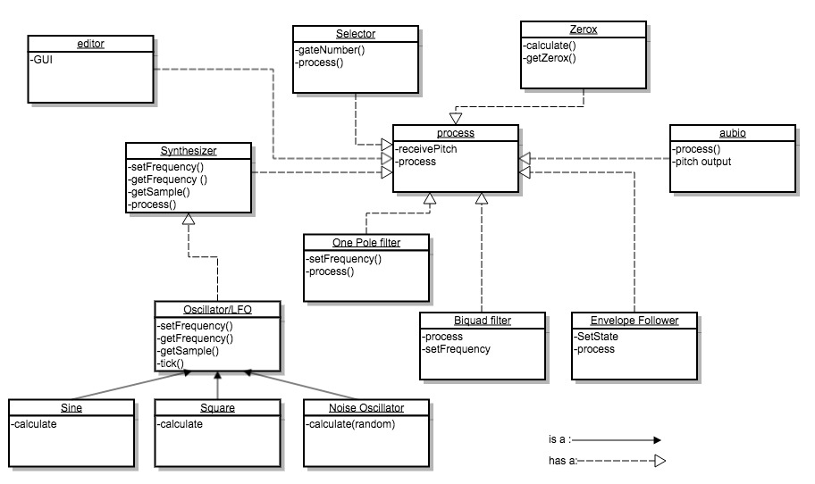
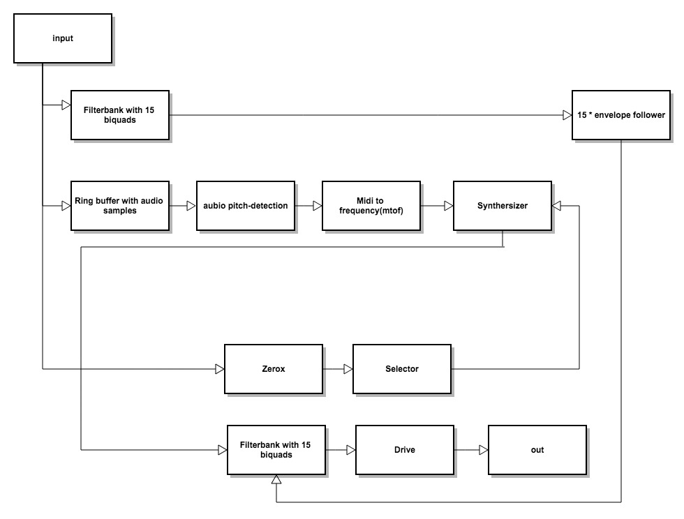
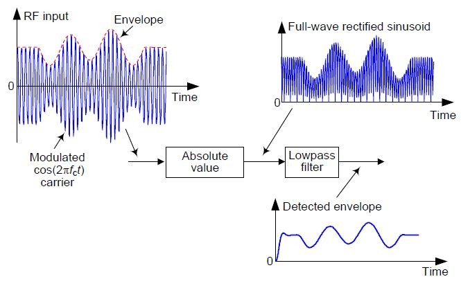

# Guitar Synth Log

###### Sound test of the first version


[](https://vimeo.com/275585891)


###### block diagram:



###### signal flow:



<!-- Before I made this plugin I have made a smaller plugin to get acquainted with Juce. This plugin can be found <a href="https://bramgiesen.com/ringmodplugin.html">here</a> -->

Voordat ik aan deze plugin ben begonnen heb ik eerst een kleinere plugin gemaakt
 <a href="https://bramgiesen.com/ringmodplugin.html">(hier te vinden)</a> om mij te verdiepen in JUCE en al wat zaken te testen zoals het implementeren van LFO's.

###### Filters:
<!-- I have used Biquad filters for the vocoder. This vocoder has 15 bandpass filters that are used in combination with the envelope follower to measure the power within each band.

I began the filter design with a mono filter. Because I wanted to use a lot of filters with the option to use it with a stereo signal I adjusted my code a bit and used 3d vectors as buffers for the filter.

Because I use the 3d vectors I don't need to filter objects for a stereo channel but just one, which is convenient since I use a lot of filters. Each 3d vector contains 2 vectors for the channels and each of these channel vectors contain two vectors for the delay buffer of the filter. -->


Voor de filter implementatie heb ik gekozen voor een biquad filter, direct form II. Deze filter werkt met twee delaybuffers. Voor de buffers gebruik ik een aantal vectors. Ik ben begonnen met een mono implementatie, dus waarbij je voor ieder stereo-kanaal twee buffers moest aanmaken. Nadat ik dit werkend had ben ik gaan nadenken hoe ik dit efficiënter kon maken.

Toen kwam ik op het idee om 3d vectors te gebruiken. Ik heb 1 vector aangemaakt waarin 2 vectoren zitten voor de kanalen(stereo) deze vectoren bevatten ieder weer twee vectoren voor de delayBuffers.

```
channelBuffers[channel][delayBuffer][delay];

```

<!-- When I first implemented the filters I used double filtered the signal(so I had 60 filters in total) but this made the sound very soft and it didn't made it sound better so I reduced the filters to 30 filters. -->

Ik had eerst een implementatie waarbij het geluid dubbel werd gefilterd, hierdoor werd het erg zacht, hierdoor moest ik het heel erg versterken, uiteindelijk heb ik ervoor gekozen om minder filters te gebruiken en nu klinkt het harder en ook een stuk beter.

###### for loops:

Omdat er een behoorlijk aantal filters in een vocoder zitten, 30 stuks, heb ik mijn programma zo geschreven dat deze worden aangemaakt en ook binnen de process-functie heb ik veel for loops gebruikt om de code op deze manier flexibel en overzichtelijk te houden.


<!-- To make my project more flexible and keep it clean I used for loops to create the filters. I also used for loops to send the samples to the filters in the audio process function. -->

```
bandPassFilters = new Biquad*[30];


for (int i = 0; i < 30; i++){
    bandPassFilters[i]
    = new Biquad(1.0, filterFreqs[i % 15]
      / lastSampleRate, 40.0);
}

```

```
//process function

for (int filterIndex = 0; filterIndex < 15; filterIndex++){
             float filterSignal = bandPassFilters
             [filterIndex + 15]->process(channel, synthSample);
             addedfilterSignal = (filterSignal * envFollowValues[filterIndex]) + addedfilterSignal;
         }
```


###### Zerox:

Ik voor mijn zero crossing class het zerox~ object van Max als referentie genomen. Ik heb gekeken naar de werking van het object en naar de output. Hierna heb ik gekeken hoe ik dit zelf zou kunnen maken en ik heb nadat ik de code had gemaakt de output van mijn Zerox class vergeleken met het zerox~ object van Max om zo mijn output te verifiëren.

###### Envelope follower:



Dit is het systeem dat heb gebruikt voor mijn envelope follower. Het artikel is <a href="https://www.dsprelated.com/showarticle/938.php">hier</a> te lezen. De absolute value bereken ik door de absolute waarde te pakken van het inkomende signaal over een x aantal samples. Als alle waarden bij elkaar zijn opgeteld deel het ik weer door x.
Dit gaat vervolgens door een one pole lowpass filter heen.

###### oscillatoren:
Naast het analyse deel en filtering heeft een vocoder ook een aantal oscillatoren. Als basis heb ik de classes uit blok csd2c gebruikt. Voor de noise oscillator heb ik de sinus formule vervangen met een random functie om op deze manier ruis te genereren. Op dit moment gebruik ik FM-synthese om een vollere klank te krijgen.  

###### Aubio:
Ik vond het lastig om aubio aan de praat te krijgen binnen Xcode. Uiteindelijk bleek dat ik het framework via een ander menu moest toevoegen.  

Hierna ging de rest relatief makkelijk. Ik moest wel de window en hopsize aanpassen om goede resultaten te halen.
In eerste instantie stond de window- en hopsize redelijk laag en hierdoor trackte aubio alleen de hoge noten redelijk, alle lagere frequenties niet. nadat ik de windowsize had veranderd naar 4096 en de hopsize naar 1024 werkt het goed.

Ik koppel aubio aan JUCE door de samples afkomstig uit de buffer van JUCE weg te schrijven naar een ringbuffer, deze geef ik doormiddel van een pointer door aan aubio.

###### Van aubio naar de synth:

Aubio pakte de frequenties redelijk goed maar er zaten wel pieken en dalen in de pitch in Hertz die aubio teruggaf.
hiernaast waren er ook nog andere kleinere fluctuaties alsmede dat de pitches die aubio terug geeft niet stemmingssysteem gebonden zijn dus passen zij ook niet allemaal in ons westers stemmingssysteem. Om dit op te lossen reken ik de frequenties van aubio eerst om naar de MIDI-nootwaarde waar de frequentie het dichst bij zit. Hierna geef ik die MIDI-nootwaarde door aan een mtof functie die het weer omzet naar de juiste frequentie.

Om de fluctuaties tegen te gaan schrijf ik de gedetecteerde pitches weg in een array en wordt er iedere 200 samples gekeken welke pitch er het meeste in de array voorkwam en deze wordt dan doorgeven aan de synth.

###### dynamiek en distortion:

Het geluid heeft nog wat pieken wat betreft de amplitude, ik denk dat ik dit kan oplossen door een clip op de envelope follower output te zetten. Voor de distortion gebruik ik nu een soft clip systeem maar ik ga nog kijken hoe het klinkt met hard clipping distortion omdat ik denk dat zo'n karakteristiek goed bij dit effect kan passen.

###### GUI:

Ik had in mijn oorspronkelijke GUI de parameters aangemaakt in for loops en in verschillende structs, hiermee word de GUI in verschillende vlakken onderverdeeld. Hoewel dit een mooier systeem was heb ik dit voor nu laten zitten in verband met de tijd. De GUI zelf stond al maar hij moest nog gekoppeld worden aan de processor class van JUCE. Omdat ik nog niet had uitgezocht hoe ik dit precies moest doen dacht ik dat het toch iets te veel tijd zou gaan kosten. Hierom heb ik gekozen om te gaan voor een vergelijkbare GUI die ik al in een eerder project had gebruikt omdat ik hierbij precies wist hoe ik het moest coderen.

###### Vervolgstappen:

Ik vond dit een geslaagd in interessant project. Ik ga er wel nog zelf verder mee aan de slag om bepaalde zaken nog te verfijnen.

* buffers van verschillende grote gebruiken voor de aubio pitch-detectie.
Zo kan de latency bij hoge noten worden verkleind.
* Attack en release envelope maken. Nu kan ik deze twee parameters aanpassen door de lowpass frequentie op het amplitude signaal aan te passen. Maar ik ga hier nog een echte envelope class voor schrijven met onset detectie.
* In z'n algemeen de parameters optimaliseren, onderzoeken wat het beste resultaat geeft.  
